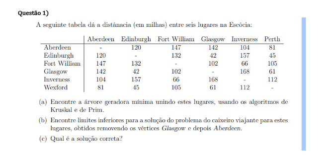
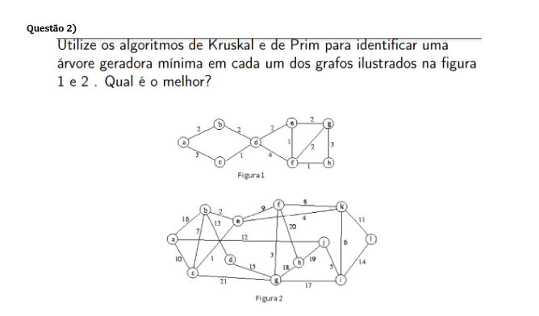
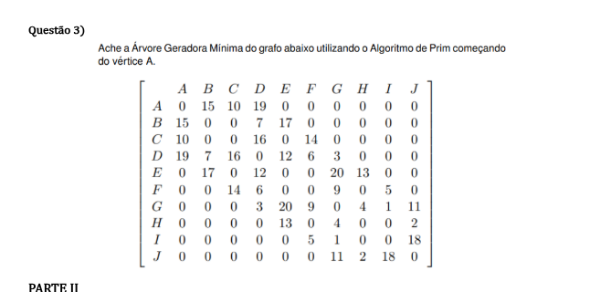

# Algoritmos baseados em problemas com grafos

um repositório com a minha resolução de problemas para o projeto prático de Estrutura Discreta e Lógica.

- Questão 1:

- Questão 2:

- Questão 3:

## Execução das soluções 
